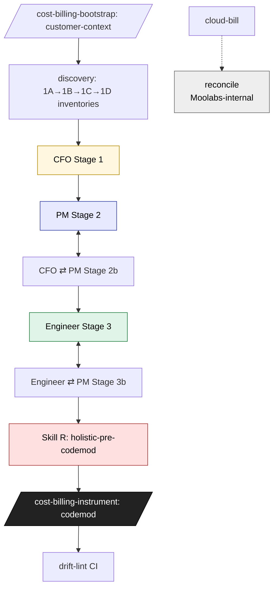

# cost-billing-shared — Shared assets for the Cost+Billing Discovery & Instrumentation Suite

This directory holds material that **all six skills** in the suite depend on. It is not invoked directly. Each SKILL.md links here.

## The Suite

Six sibling skills implement the framework from `docs/grooming/2026-05-19-cost-billing-discovery-requirements.md`. Each is independently invocable; together they form the customer integration pipeline.

| Order | Skill | Purpose |
|-------|-------|---------|
| 1 | `/cost-billing-discovery` | Skill A — scan customer repo, produce three inventories (cost / usage / output↔input). |
| 2 | `/cost-billing-cloud-bill` | Skill B — wire AWS CUR / GCP BigQuery export / Azure Cost Management; surface cell ③ findings. |
| 3 | `/cost-billing-instrument` | Skill 2 — codemod that wires SDK calls (cost + usage) into customer code. **Framework's core deliverable.** |
| 4 | `/cost-billing-drift-lint` | Skill 3 — CI step that diffs code against saved inventories on every PR. |
| 5 | `/cost-billing-adversarial-review` | Skill R — 5-phase adversarial review gate; runs 6 times per pipeline. |
| 6 | `/cost-billing-reconcile` | Skill C — WAPE/Coverage validation harness; engineering-internal (Moolabs). |

## Pipeline order

Skill R adversarial-review fires at every stage handoff (post-discovery, post-cfo-stage1, post-pm-stage2, post-engineer-stage3, holistic-pre-codemod, post-codemod) — see `gaps-tracker.md` §6.3 for the v1 decision on whether R also runs on B and C.

## Read these before invoking any skill

| File | What it gives you |
|------|-------------------|
| `anchor-taxonomy.md` | Load-bearing vocabulary — every downstream skill agrees on these terms. |
| `v1-decisions-log.md` | The 11 §10 decisions resolved for v1. **Mark these revisited at HLD.** |
| `sdk-surface-reference.md` | Verified-against-code SDK call shapes — `client.usage.ingest_events`, `client.cost.ingest_events_batch`, namespace inconsistencies. |
| `three-role-review.md` | CFO / PM / engineer projection model the review surface emits. |
| `gaps-tracker.md` | The §6 open questions — what's still ambiguous, with v1 status. |

## Source of truth

- Requirements: `docs/grooming/2026-05-19-cost-billing-discovery-requirements.md`
- Source docs (gated): Doc 1 `JRsb8oZxxd`, Doc 2 `uFNMOWABYB`, Doc 3 `3ef884d4` on docs.moolabs.com
- Reference SDKs: `github.com/moolabs-hq/moolabs-{py,go,ts}`, local at `../moolabs-py/`
- Reference services: `../moolabs/services/{moo-acute,moo-meter}` and `../moolabs/sdks/generator/`
