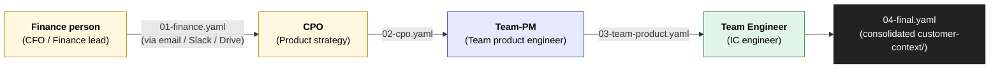
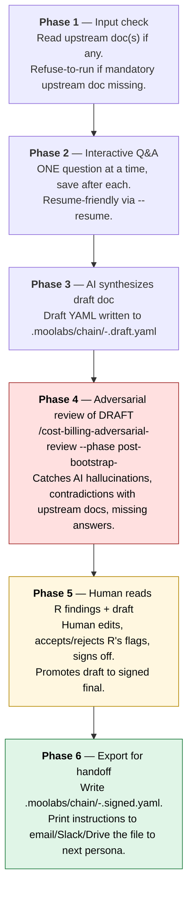

# Chain handoff workflow — 4 silos, manual export, signed at each stage

The Cost+Billing suite's bootstrap is **NOT** a single session on a single machine. It's a **chain of 4 sequential bootstraps**, each on a different persona's machine, with a manually-exported signed YAML flowing between them.

Locked design (user clarification, 2026-05-19):

> "we assumed all the skill persona (finance, Product manager and Engineer) are on the same machine and are being executed by the same person, while I am saying the reviewing after adversarial review and bootstrapping doc will be generated by all three personas (all of them first reviewed and questioned by ai and then worked by people), finance -[finance doc]-> product(CPO) -[primary product doc]-> team product engineer -[team product doc]-> team engineer --> final doc"

---

## The chain



Each persona only runs their OWN bootstrap skill on their OWN machine. They never see the other personas' install or tooling. The handoff between machines is a single signed YAML, transported by whatever channel the customer prefers (email, Slack, Drive, S3 signed URL — chosen at install time).

---

## Per-silo invariants

Each of the 4 bootstrap skills follows the same 6-phase invariant:



**Skill R fires in Phase 4 (AFTER AI synthesizes, BEFORE human signoff)** — per user decision 2026-05-19. The human reads R's findings ALONGSIDE the draft, so they can accept R's catches before signing. Human authority is preserved (R doesn't block; human signs off knowingly).

---

## What each silo owns

| Silo | Input | Asks about | Output |
|---|---|---|---|
| **1. Finance** | (none — first in chain) | Pricing model TYPE + sub-aspects; pricing source of truth; billable units (CFO words); fair-usage + overages + bundling; per-customer custom pricing; compliance regimes (SOC2/HIPAA/GDPR/FedRAMP); PII/PHI blocklists; **region(s)**, **environments**, **multi-tenant shape** (these are contractual/regulatory — CFO owns) | `01-finance.yaml` |
| **2. CPO** | `01-finance.yaml` | Company + product names (+ vertical split if multi-product); product documentation source(s) — folders, URLs, MCPs; top features customer-enumerated; internal-only callouts; end-user term; billable-output term; unique customer concepts | `02-cpo.yaml` |
| **3. Team Product** | `01-finance.yaml` + `02-cpo.yaml` | Per-feature drill-down on billable unit choices; output↔input map at concept level (which features depend on which vendor calls); event_type naming convention; synonyms / aliases between docs and code | `03-team-product.yaml` |
| **4. Team Engineer** | `01-finance.yaml` + `02-cpo.yaml` + `03-team-product.yaml` | Repo path(s); languages + frameworks; build + test commands; branch strategy; primary tracer + secondary instrumentation; request-context propagation pattern; attribute prefixes to avoid; agent surface + active LLM + MCP inventory + MCP selection + MCP restrictions; **SDK key location + read pattern** (only — region/env/tenancy came from finance) | `04-final.yaml` (the consolidated customer-context all downstream skills read) |

---

## Handoff mechanism (manual export — by user choice)

> "Email / Slack / Drive (manual). Bootstrap exports a signed YAML; finance sends it to CPO via whatever channel they use. Next persona's bootstrap takes `--input-from=<path>`. Zero git footprint of finance/pricing details."

Each silo's Phase 6 emits exactly:

```
✓ Stage <N> complete. Signed doc written to:
  .moolabs/chain/<NN>-<stage>.signed.yaml  (<bytes>, sha256: <hash>)

NEXT STEP for <persona>:
  Send this file to <next persona> via your preferred channel.
  Common options:
    • Email attachment
    • Slack DM with the file attached
    • Google Drive / SharePoint shared folder
    • Signed S3 URL
    • Encrypted blob (1Password / pass / age) for extra-sensitive data

  The next persona will run:
    /cost-billing-bootstrap-<next-stage> --input-from <NN>-<stage>.signed.yaml
```

No git commit. No central registry. The customer's existing collaboration channel is the transport.

If a customer wants automated/git-based transport, they can opt in via `--export-mode=git-branch` (writes to `.moolabs/chain/` and commits to a `chain/` branch). Default is manual file export.

---

## Signed-doc shape (every stage)

Every `chain/<NN>-<stage>.signed.yaml` includes:

```yaml
$schema: https://moolabs.com/schemas/cost-billing-chain/<stage>/0.1.0
stage: finance | cpo | team-product | team-engineer
chain_position: 1 | 2 | 3 | 4
generated_at: <ISO-8601>
generator: cost-billing-bootstrap-<stage>@<version>
agent_surface: claude_code | cursor | ...
llm_used: claude-opus-4-7 | gpt-4o-... | ...

input_chain:
  - stage: <previous stage>
    file: <path to upstream signed doc>
    sha256: <hash>
    signed_at: <ISO-8601>
    signed_by: <persona role>
    # Bootstrap refuses to run if a referenced upstream file is missing OR its
    # hash doesn't match — catches stale handoffs.

adversarial_review:
  phase: post-bootstrap-<stage>
  invocation_at: <ISO-8601>
  verdict: clean | clean-with-accepted-risks | blocked
  reviewer_model: <different model from llm_used>
  findings_total: N
  findings_human_accepted: M           # findings the human acknowledged but accepted as non-blocking
  findings_resolved: K                  # findings the human fixed in the draft

signoff:
  signed_by_role: finance | cpo | team-product | team-engineer
  signed_by_name: "<human-provided name>"
  signed_at: <ISO-8601>
  signed_method: "interactive-cli"
  notes: |
    (Free-form note from the human signer. Mandatory if any R finding
    was accepted-as-risk rather than resolved.)

# ... then the stage-specific content below this point ...
```

Downstream skills validate the chain by:
1. Walking `input_chain` recursively
2. Verifying each referenced file's sha256 matches
3. Refusing to proceed if any signoff is missing or any R verdict is `blocked`

---

## Resume + refresh

Each silo supports:

- `--resume` — continue from the last unanswered question (using the draft state file)
- `--refresh` — start over but keep prior answers as defaults (saves re-typing for refinement passes)
- `--input-from <path>` — explicitly specify the upstream doc (default: looks in `.moolabs/chain/`)
- `--section <category-id>` — re-ask only one category within the stage

---

## When a customer is one person wearing all hats

For startups / solo founders where one human is finance + CPO + team-PM + team-engineer all at once: the customer runs all 4 bootstraps on the same machine. The chain still flows through 4 signed docs (forces the human to context-switch between roles and check their own work), but no transport is needed — each subsequent bootstrap reads from `.moolabs/chain/` directly.

`/cost-billing-bootstrap-all` (if installed via `--persona all`) is a thin wrapper that runs the 4 in sequence on one machine — useful for dogfood + smoke-test installs.

---

## Why 4 silos and not 3 (CFO / PM / Engineer)

The earlier 3-role review surface (CFO / PM / Engineer in `three-role-review.md`) was about WHO REVIEWS each artifact. This 4-silo chain is about WHO GENERATES the input docs that drive the artifacts.

The split between CPO (org-level product strategy) and Team-Product (team-level PM working on specific features) matters because:
- **CPO owns terminology + product surface area** — what the customer calls a "completion" vs a "generation", what features exist at all.
- **Team-PM owns per-feature decisions** — for `completion.delivered`, exactly which inputs feed it; what the right derivation is; what edge cases (streaming, partial-stream collapse) apply.

Conflating these two roles into one bootstrap stage loses the layered decision authority that real product orgs have. Keep them separate.
