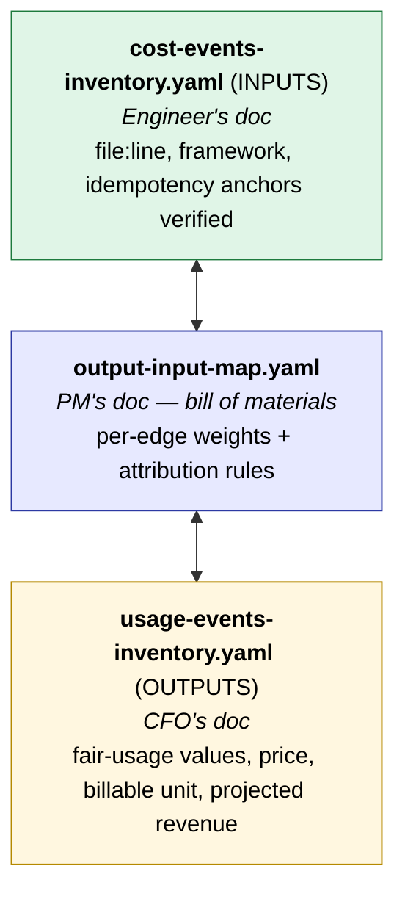

# Three-role review surface — sequential generators with TWO review loops

> **NAMING CONVENTION (v0.3+):** All per-stage signoff filenames below use the suffixed form `<stage>-signoff-<product-slug>.yaml` (for pm-stage2 / cfo-stage2b) or `<stage>-signoff-<service-slug>.yaml` (for engineer-stage3 / pm-stage3b). Per `cost-billing-shared/chain-handoff.md`, this is how multi-product / multi-service fan-out works. **Single-product / single-service customers still use the suffixed form** with their only-product / only-service slug (e.g., `pm-stage2-signoff-acme.yaml` when company has one product `acme`) — preserves forward-compat with future fan-out without retroactive renames. The v0.2-style bare `pm-stage2-signoff-<product>.yaml` is REJECTED by the v0.3 codemod gate. Only `cfo-stage1-signoff.yaml` and `holistic-r-review.md` remain bare (they're org-wide, cardinality=1).

The customer's review process has three role-specific generators (CFO / PM / Engineer), each producing their own artifact, with **two review loops centered on the PM**: a CFO ⇄ PM loop upstream and an Engineer ⇄ PM loop downstream.

Clarified by user 2026-05-19:

> "so doc/json/yml file generated by CFO skill is reviewed by PM, then doc generated by PM is reviewed by CFO, once approved is reviewed by engineers"
>
> "engineers <-> product managers"

The PM sits at the apex. PM converts CFO's economic spec into a billable-unit specification, then converts engineer's code-reality back into PM-level changes the CFO might need to revisit. PM owns both loops.

---

## Workflow shape — a Y with PM at the apex

```mermaid
flowchart TD
    S1["<b>STAGE 1 — CFO generates cfo-spec</b><br/>Fair-usage value per product<br/>Proposed billed unit + price<br/>Projected monthly revenue<br/><i>Output: cfo_metadata in usage-events YAML</i>"]

    S2["<b>STAGE 2 — PM generates pm-spec</b><br/>Billable-unit specs per output<br/>Output↔input map (bill of materials)<br/>Per-edge weights + attribution rules<br/><i>Output: output-input-map.yaml + PM edits to usage-events-inventory</i>"]

    S2b{{"<b>STAGE 2b — CFO ⇄ PM loop</b><br/>CFO reviews PM's doc<br/>Disagree → PM revises → CFO reviews again<br/>Converges within 3 cycles or escalates<br/><i>Outputs: cfo-stage2b-signoff + pm-stage2-signoff approved</i>"}}

    S3["<b>STAGE 3 — Engineer generates engineer-spec</b><br/>file:line per entry<br/>Framework adapter choice<br/>Idempotency anchor decision<br/>False-positive rejects + sibling moves<br/><i>Output: engineer-edits to cost-events-inventory + engineer-spec.yaml</i>"]

    S3b{{"<b>STAGE 3b — Engineer ⇄ PM loop</b><br/>PM reviews engineer's doc<br/>If code reality breaks PM's unit/mapping<br/>(e.g. completion is actually a stream)<br/>PM updates pm-spec → engineer revises<br/>Engineer-initiated reopens needing CFO bubble up to Stage 2b"}}

    R["<b>STAGE 4 — Holistic Skill R gate</b><br/>/cost-billing-adversarial-review --phase holistic-pre-codemod<br/>Final blocking authority"]

    CM["<b>/cost-billing-instrument</b><br/>codemod runs<br/><i>(the only stage that emits new code)</i>"]

    S1 -- "PM reads CFO's doc" --> S2
    S2 -- "CFO reads PM's doc" --> S2b
    S2b -- "PM revises after CFO feedback" --> S2
    S2b -- "Engineer reads PM's approved doc" --> S3
    S3 -- "PM reads engineer's doc" --> S3b
    S3b -- "Engineer revises after PM feedback" --> S3
    S3b --> R
    R --> CM

    style S1  fill:#fff7e0,stroke:#b58900,color:#000
    style S2  fill:#e7e9ff,stroke:#2c39a3,color:#000
    style S2b fill:#fff,stroke:#666,stroke-dasharray:4 2,color:#000
    style S3  fill:#e0f5e7,stroke:#1d7a3d,color:#000
    style S3b fill:#fff,stroke:#666,stroke-dasharray:4 2,color:#000
    style R   fill:#ffe0e0,stroke:#a32c2c,color:#000
    style CM  fill:#222,stroke:#000,color:#fff
```



---

## Artifact ownership

Each role generates one or more artifacts; the next role's review either approves them or sends them back.

| Stage | Role | Writes / edits | Reads (their input) |
|---|---|---|---|
| 1 | CFO | `usage-events-inventory.yaml` (fills `cfo_metadata` per entry); writes `reviews/cfo-spec.md` (human narrative) | Skill A's initial draft of usage-events + `pricing-page` if available |
| 2 | PM | `output-input-map.yaml` (creates from scratch); `usage-events-inventory.yaml` (edits `refund_unit.unit` per entry); writes `reviews/pm-spec.md` | CFO's cfo-spec + draft cost-events + draft usage-events |
| 2b | CFO | `reviews/cfo-stage2b-signoff-<product>.yaml` (approves or rejects PM's spec); may revise own cfo_metadata | PM's pm-spec + updated map |
| 2b | PM | revises pm-spec + output-input-map based on CFO feedback | CFO's revised cfo-spec |
| 3 | Engineer | `cost-events-inventory.yaml` (verifies `file:line`, `framework`, `idempotency_anchor`); writes `reviews/engineer-spec.md` | PM's approved pm-spec + the codebase |
| 3b | PM | reviews engineer-spec; if engineer reports a code reality that breaks a unit/mapping decision, PM revises pm-spec | Engineer's eng-spec |
| 3b | Engineer | revises engineer-spec | PM's revised pm-spec |
| 4 | Skill R | `reviews/holistic-r-review.md` with `verdict: clean` / `clean-with-accepted-risks` / `blocked` | All three signed-off artifacts |

---

## The graph (one underlying artifact, three projections)



Each artifact is a YAML file; each role's "doc" is the section of that YAML they own + the markdown narrative that explains their rationale.

---

## Stage 1 detail — CFO generates cfo-spec

**CFO opens:** `reviews/cfo-spec.md` (template provided by Skill A) + `usage-events-inventory.yaml` (draft from Skill A Phase 5 with placeholder `cfo_metadata`).

**CFO fills in per output:**

```yaml
- workflow_id: api.completion.completion-delivered
  event_type: completion.delivered
  cfo_metadata:
    proposed_billed_unit: "per 1k tokens"     # CFO picks unit
    proposed_unit_price_usd: 0.02              # CFO picks price
    fair_usage_threshold:                      # CFO sets fair-usage
      quantity: 50000
      unit: tokens
      period: month
    projected_monthly_revenue_usd: 3200.00     # CFO computes from usage estimates
```

**CFO's narrative** (`reviews/cfo-spec.md`):

```markdown
# CFO Spec — <customer> — 2026-05-19

## Fair-usage values per product

| Output | Fair-usage value | Rationale |
|---|---|---|
| completion.delivered | $0.02 / 1k tokens, 50k free per user/month | Matches GPT-4 cost + 30% margin; free tier captures 70% of users. |
| image.rendered | $0.15 / render | Higher margin justified by cold-start cost. |

## Entries marked internal (do not bill)

- internal.cron.healthcheck — operations overhead.

## Entries left for PM discussion

- api.streaming.chat-streamed — unit choice depends on whether stream emits per-token cost-events.
```

**CFO signs off:** `reviews/cfo-stage1-signoff.yaml`:

```yaml
status: approved
generated_at: 2026-05-19T14:23:00Z
entries_priced: 12
entries_marked_internal: 3
entries_open_to_pm_discussion: 1
```

---

## Stage 2 detail — PM generates pm-spec

**PM opens:** CFO-signed-off `usage-events-inventory.yaml` + draft `cost-events-inventory.yaml`. PM creates `output-input-map.yaml` from scratch.

**PM does:**

1. Picks **billable unit per output**, consistent with CFO's pricing intent. PM edits `refund_unit.unit` in `usage-events-inventory.yaml`:

   ```yaml
   refund_unit:
     unit: per_token_1k                # PM commits to this
     derivation: "response.usage.completion_tokens"
   ```

2. Builds `output-input-map.yaml` — the bill of materials. For each output, lists the inputs that feed it with weights:

   ```yaml
   edges:
     - output_workflow_id: api.completion.completion-delivered
       derivation_strategy: equal_split
       inputs:
         - cost_workflow_id: api.completion.openai-chat
           weight: 1.0
           link_confidence: 0.92
           rationale: "primary LLM call"
   ```

3. Flags any entry where CFO's proposed unit can't be supported:

   ```yaml
   cfo_reopen_requests:
     - workflow_id: api.streaming.chat-streamed
       reason: "CFO proposed per-completion. Stream has no completion event. Recommend: per_token_1k OR collapse into chat.delivered."
   ```

**PM's narrative** (`reviews/pm-spec.md`):

```markdown
# PM Spec — <customer> — 2026-05-19

## Billable units per output (decisions + rationale)

| Output | Unit | Why |
|---|---|---|
| completion.delivered | per_token_1k | Matches CFO pricing model + supportable from openai.response.usage. |
| image.rendered | per_render | Single-render output; clean unit. |

## Output↔input bill of materials

[Renders the linkage graph from output-input-map.yaml]

## Open questions for CFO

[The cfo_reopen_requests, with PM's recommendation per entry]
```

**PM signs off:** `reviews/pm-stage2-signoff-<product>.yaml`:

```yaml
status: approved | re-open-cfo
generated_at: 2026-05-19T16:08:00Z
input_map_built: true
entries_with_unit_chosen: 12
entries_flagged_unit_unsupported: 1
cfo_reopen_requests:
  - workflow_id: api.streaming.chat-streamed
    reason: "..."
```

If `cfo_reopen_requests` is non-empty → CFO ⇄ PM loop.

---

## Stage 2b — CFO ⇄ PM loop

**Trigger:** PM emitted `re-open-cfo`, OR CFO disagrees with PM's chosen units / mapping.

**Loop:**

1. CFO reads PM's spec + reopen requests.
2. CFO updates `cfo-spec.md` and `cfo_metadata` in `usage-events-inventory.yaml`, or re-defends the original.
3. PM applies CFO's response → revises pm-spec + output-input-map.
4. Repeat until both `cfo-stage2b-signoff-<product>.yaml: approved` and `pm-stage2-signoff-<product>.yaml: approved`.

**Hard cap (v1):** 3 cycles. After 3 rounds, escalate to the customer's leadership.

**Engineer is NOT involved here.** Both economic roles converge first.

---

## Stage 3 — Engineer generates eng-spec

**Engineer opens:** PM-signed-off `pm-spec.md` + `output-input-map.yaml` + draft `cost-events-inventory.yaml`. Engineer creates `reviews/engineer-spec.md`.

**Engineer does:**

1. Verifies `file:line` for every entry in `cost-events-inventory.yaml`.
2. Confirms the framework adapter selected for each (or flags "wrong adapter").
3. Validates the idempotency anchor — checks if `{handler}.{first-id-path-param}` is actually derivable at this call site (per the v1 heuristic).
4. Rejects false positives (test fixtures, retry loops, health-check paths that slipped past the discard filter).
5. Flags entries where the code reality breaks a PM unit/mapping decision:

   ```yaml
   pm_reopen_requests:
     - workflow_id: api.completion.completion-delivered
       reason: |
         PM specified per_token_1k with derivation response.usage.completion_tokens.
         But this handler streams; response is not a single object — derivation must
         be sum(chunk.usage.completion_tokens for chunk in stream_events) at stream_complete.
         Recommend: keep unit per_token_1k, update derivation, OR change unit.
   ```

**Engineer's narrative** (`reviews/engineer-spec.md`):

```markdown
# Engineer Spec — <customer> — 2026-05-19

## Code locations verified
[15 entries verified, 2 relocated, 1 rejected as false positive]

## Adapter selections
[Per-entry framework adapter table]

## Idempotency anchors
[Per-entry idempotency-anchor heuristic results; entries needing override]

## False positives rejected
[The 2 entries Skill A flagged that are actually test fixtures / retries]

## Reopen requests to PM
[The pm_reopen_requests, with engineer's recommendation per entry]
```

**Engineer signs off:** `reviews/engineer-stage3-signoff-<service>.yaml`:

```yaml
status: approved | re-open-pm
generated_at: 2026-05-19T18:42:00Z
file_line_verified: 15
adapter_confirmed: 15
false_positives_rejected: 2
relocated: 1
pm_reopen_requests:
  - workflow_id: api.completion.completion-delivered
    reason: "..."
```

If `pm_reopen_requests` is non-empty → Engineer ⇄ PM loop.

---

## Stage 3b — Engineer ⇄ PM loop

**Trigger:** Engineer emitted `re-open-pm`, OR PM disagrees with engineer's relocations / adapter overrides / false-positive rejections.

**Loop:**

1. PM reads engineer's spec + reopen requests.
2. PM revises pm-spec + output-input-map based on engineer's code reality input.
3. **Bubble-up rule:** If PM's revision changes a billable unit or fair-usage assumption, PM bumps the issue up to Stage 2b (CFO must re-approve) — Engineer waits.
4. PM applies revisions → Engineer revises eng-spec.
5. Repeat until both `pm-stage3b-signoff-<service>.yaml: approved` and `engineer-stage3-signoff-<service>.yaml: approved`.

**No hard cap** on this loop — engineer reopens reflect code reality, and code reality wins. But each loop must converge in finite time; if it stalls, escalate.

---

## Stage 4 — Holistic Skill R gate

After all stages converge, invoke:

```
/cost-billing-adversarial-review --phase holistic-pre-codemod
```

Skill R reviews the full triplet (cost-events + usage-events + output-input-map) for cross-cutting issues:

- Orphan features.
- Double-counted inputs.
- Refund-unit drift between PM's chosen unit and engineer's derivation.
- Cross-feature trace-context conflicts.
- Idempotency-key sloppiness.
- PII / security footguns introduced by adapter choices.

Skill R's verdict is the **final** blocking authority. Even if all three roles signed off, Skill R can block the codemod and route back to whichever stage contains a bug.

---

## File layout

```
.moolabs/
  inventory/
    cost-events-inventory.yaml          # Engineer's doc (engineer fills file:line, framework, idempotency)
    usage-events-inventory.yaml         # CFO's doc (CFO fills cfo_metadata) + PM edits refund_unit
    output-input-map.yaml               # PM's doc (PM builds from scratch)
    reviews/
      cfo-spec.md                       # CFO narrative
      cfo-stage1-signoff.yaml           # CFO approves their own initial spec
      pm-spec.md                        # PM narrative
      pm-stage2-signoff-<product>.yaml            # PM approves their own initial spec
      cfo-stage2b-signoff-<product>.yaml          # CFO approves PM's spec (after possible cycle)
      engineer-spec.md                  # Engineer narrative
      engineer-stage3-signoff-<service>.yaml      # Engineer approves their own initial spec
      pm-stage3b-signoff-<service>.yaml           # PM approves engineer's spec (after possible cycle)
      holistic-r-review.md              # Skill R final adversarial gate
```

---

## Disagreement resolution rules (v1 default)

| Conflict | Resolution |
|---|---|
| CFO ⇄ PM on unit/price/mapping | Stage 2b loop, hard cap 3 cycles, then escalate. |
| Engineer ⇄ PM on code-supported unit | Stage 3b loop, no hard cap (code reality wins). |
| Engineer's reopen affects CFO-level decision (price, fair-usage) | Bubble up — PM stalls Stage 3b, re-opens Stage 2b with CFO. |
| Skill R blocks after all signoffs | Routes to whichever stage contains the bug; re-signs from that stage forward. |

---

## Why two loops?

- **CFO ⇄ PM** because pricing and unit selection co-evolve. CFO sets a price; PM may find the customer's code can't emit at the right level. They must converge.
- **Engineer ⇄ PM** because PM is upstream of engineer in the spec hierarchy, but engineer is closer to code truth. Engineer often discovers things PM couldn't have anticipated (a "completion" that's actually a stream; a "render" that's actually a multi-step pipeline). PM owns adapting the spec.
- **Engineer never talks directly to CFO** in v1. All engineer→CFO communication routes through PM. This keeps the workflow tractable: PM owns translating between code reality and business reality.

---

## Async behavior

Each role works async. Sequence is enforced by what files exist:

- Stage 2 (`pm-spec.md` + `pm-stage2-signoff-<product>.yaml`) is invalid until `cfo-stage1-signoff.yaml: approved` exists.
- Stage 2b cannot complete until BOTH `cfo-stage2b-signoff-<product>.yaml: approved` AND `pm-stage2-signoff-<product>.yaml: approved` exist.
- Stage 3 cannot start until Stage 2b is complete.
- Stage 3b cannot complete until BOTH `pm-stage3b-signoff-<service>.yaml: approved` AND `engineer-stage3-signoff-<service>.yaml: approved` exist.
- Holistic Skill R cannot run until Stage 3b is complete.
- `/cost-billing-instrument` cannot run until holistic-r-review has `verdict: clean` or `clean-with-accepted-risks`.

The codemod precondition checks file existence + signoff statuses + Skill R verdict.

---

## v2 web UI migration plan

When v2 ships, the underlying YAML stays. The UI is a renderer that:
- Shows CFO their stage 1 + stage 2b screen.
- Shows PM their stage 2 + stage 3b screen.
- Shows engineer their stage 3 screen.
- Enforces the sequence via stage-gating + signoff buttons.
- Shows the full Y-diagram with live cycle counters.
