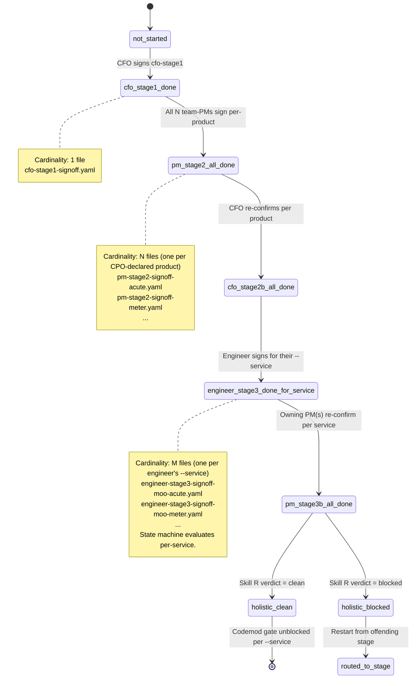

# State machine — `/cost-billing-signoff`

Detailed state diagram + transition rules. The declarative config lives in `assets/state-machine.yaml`; this doc is the human-readable explanation.

## Diagram



## How the skill computes "current state"

On every invocation, the skill:

1. Lists `.moolabs/inventory/reviews/*-signoff*.yaml`.
2. Parses each to extract `stage`, `status`, `product_slug` / `service_slug` (where applicable).
3. Loads `02-cpo.signed.yaml > products[]` for the canonical product/service lists.
4. Computes the "highest done" stage globally + per-product + per-service.
5. Determines the next action based on the persona (if `--persona` passed; otherwise infers from install context — see persona-stage-table in `assets/state-machine.yaml`).

## Re-open rules

A signoff's `status` field can be `approved` (move forward) or `re-open-<who>` (loop back to that stage). Re-open invalidates downstream signoffs per the rules in `state-machine.yaml > reopen_rules`. The skill emits clear warnings when a re-open causes other signoffs to become stale:

```
⚠️ engineer-stage3-signoff-moo-acute.yaml had status=re-open-pm.
   Following signoffs are now INVALID:
     - cfo-stage2b-signoff-acute.yaml
     - cfo-stage2b-signoff-arc.yaml
   Reason: PM mapping change affects ALL products this service belongs to.

   Next action: PM Alice (acute) re-runs /cost-billing-signoff --persona team-product --product acute --section per-feature
```

## Multi-service shared engineer

If an engineer owns multiple services (e.g., Dan owns both `moo-acute` and `moo-arc`), they invoke per-service:

```
/cost-billing-signoff --persona team-engineer --service moo-acute
/cost-billing-signoff --persona team-engineer --service moo-arc
```

Each writes its own `engineer-stage3-signoff-<S>.yaml`. The codemod per `--service <S>` only requires that S's signoff, not the others — engineers can iterate independently.

## Holistic gate cardinality

`holistic-r-review.md` is ONE file (org-wide). It runs after ALL per-service `pm-stage3b-signoff-<S>.yaml` files are approved. The codemod then unblocks per-service: each engineer runs `/cost-billing-instrument --service <slug>` independently.

## Skill R verdict handling

- `clean` → state machine advances.
- `clean-with-accepted-risks` → state machine advances; the `notes` field in the signoff explains the risks.
- `blocked` → state machine HALTS. Routes back to whichever stage R's findings name as the source of the bug. Re-do from there.

## When `02-cpo.signed.yaml > products[]` changes mid-chain

If CPO re-runs Q11 and adds a new product mid-chain (rare but possible), the state machine detects the new slug, marks the new product's pm-stage2-signoff-<new>.yaml as MISSING, and routes the relevant team-PM to start their signoff. Existing per-product signoffs are NOT invalidated (CPO's add doesn't retroactively change other products' decisions).

If CPO REMOVES a product, existing per-product signoffs become orphaned — the skill warns but doesn't delete them (audit trail).
