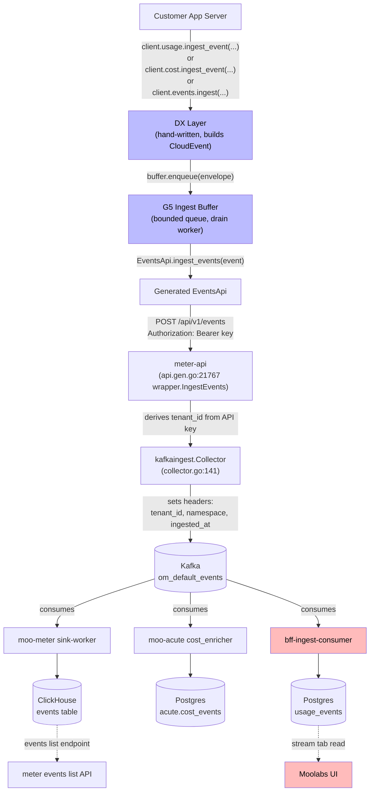

# PRD: Unified Ingest-Event Surface Refactor

**Status:** Draft for implementation
**Author:** kritivasrocks@gmail.com
**Date:** 2026-06-01
**Brainstorming context:** Five-section conversation 2026-06-01 ending in this doc; commit history under `moolabs-demo:demo/unified-events-stream@4bb472b` and `moolabs:feature/unified-sdk-ingest/initial-bff-and-acute` (PR #468).
**Doc kind:** PRD/TDD (interchangeable per the `ralph-skills:prd` skill — same template).

---

## 0. Prerequisites

Implementer must verify before writing code:

- [x] **Problem validated end-to-end on dev** — 2026-06-01 demo on `moolabs-demo:demo/unified-events-stream` proved (a) the SDK already exposes a unified path (`client.usage.ingest_events`) routed to `meter.{base}/api/v1/events`, (b) that endpoint already fan-outs through `om_default_events` Kafka topic to three consumers (moo-meter sink → ClickHouse; moo-acute cost_enricher; bff-ingest-consumer → Postgres `usage_events`), (c) events get accepted (HTTP 204) but were DLQ'd at the BFF consumer because of a tenant-resolution gap that surfaced as the customer-facing failure mode "nothing in stream tab."
- [x] **Affected services identified** — `moolabs-py`, `moolabs-ts`, `moolabs-go` (three SDK repos); `moo-skills/skills/cost-billing/*` (six skills + shared); `services/moolabs-app/bff/app/workers/ingest_consumer.py` (one-commit fix); slimmed PR #468 covering `services/moo-meter/openmeter/*` + `services/moo-acute/app/*`.
- [x] **Prior art reviewed** — examined `services/moo-meter/openmeter/meterevent/httphandler/event.go:28` (existing `/api/v1/events` route), `services/moo-meter/openmeter/ingest/kafkaingest/collector.go:141-162` (existing Kafka producer + header set), `services/moo-acute/app/workers/cost_enricher.py:1173` (existing topic consumer), `services/moolabs-app/bff/app/workers/ingest_consumer.py:1552-1724` (BFF resolution chain), `moolabs-py/moolabs/_dx_namespaces.py:UsageNamespace._ingest_events` (the buggy DX wrapper).
- [x] **Stakeholder alignment** — user is engineering lead; design built through five rounds of incremental approval in the brainstorming session.
- [x] **Current architecture** — codemaps referenced for moo-meter, moo-acute, moolabs-app/bff.
- [x] **Data model** — no new tables. Existing `om_default_events` Kafka topic + ClickHouse `events` table + Postgres `usage_events`. `request_id` column on ClickHouse `events` already added by PR #468 commit A2+C1.
- [x] **Auth model** — `meter.{base}/api/v1/events` authenticates via `Authorization: Bearer <api-key>`; tenant derived server-side from key. SDK never sends tenant headers. Verified on dev with API key `d705b280...` for tenant `3afeb122-c787-4564-b7eb-32f108f83079`.
- [x] **Deployment model** — `bff-ingest-consumer` runs on ECS cluster `moolabs-dev-cluster` (task def `bff-ingest-consumer:199`, desired=1 running=1); meter-api / meter-sink-worker / acute-cost-enricher all on the same cluster.
- [x] **Spike completed** — demo proved the unified envelope round-trips end-to-end. 3 events landed in BFF Postgres `usage_events` after the tenant_id injection workaround (TOTAL=3 visible at `GET api.dev.moolabs.com/v1/usage/?subject_id=cust-test-001`).
- [x] **Cost estimate** — negligible. Net additive code; SDK release; no new infra. Skill suite shrinks ~46% in LOC.

---

## 1. Overview

The Moolabs SDK already has a unified ingest path — `client.usage.ingest_events(...)` posts to `meter.{base}/api/v1/events`, which publishes to `om_default_events` and fans out to all three downstream consumers. The cost-billing skill suite (today) generates customer-side helpers that build envelopes by hand and route the cost lane to `client.cost.ingest_events_batch` (acute direct path) while the usage lane goes to `client.usage.ingest_events` (meter). This produces **two sibling envelopes per workload** linked by `usage_event_id`, requires customers to construct CloudEvents shapes manually, and hard-codes a Phase-1.5 `cost_event_direct_emit` capability toggle that branches transports.

This PRD specifies (a) three new ergonomic-kwarg DX methods in the SDK (`client.usage.ingest_event`, `client.cost.ingest_event`, `client.events.ingest`) that hide envelope construction and route both lanes through the unified endpoint, (b) a ~65% shrink of the skill suite's `emit_*_safe` helper templates as they become thin wrappers around the SDK, and (c) a slim-down of PR #468 to drop the parallel BFF `/v1/events` route while keeping the moo-meter + moo-acute hardening and adjustment workers.

---

## 2. WHAT — Requirements & Scope

### Problem Statement

**Who's affected:** Moolabs customers integrating the SDK via the cost-billing skill suite. **The impact today:**

1. **Customer-side complexity:** Today's helpers (`emit_usage_event_safe`, `emit_cost_event_safe`) hand-build CloudEvent shapes, manage two transport paths, require `tenant_id` as a kwarg (even though the API key already carries it), and forced a sibling-pair join (`usage_event_id`) downstream. ~390 LOC of template per language, ~150 of it Jinja-conditional.
2. **SDK has a bug we hit live:** `UsageNamespace._ingest_events(events: list)` in `moolabs-py` passes a list to the underlying generated `EventsApi.ingest_events(event: Event)`, which Pydantic-rejects. Verified on the dev demo — first emission attempts failed with `1 validation error for EventsApi.ingest_events`. Customers using the DX surface as documented get a runtime error.
3. **The "unified surface" we thought we needed didn't need building:** PR #468 added a parallel `POST /v1/events` on BFF that produces to the same Kafka topic as `meter.../api/v1/events`. Same downstream fan-out. Twenty-one commits of work that turned out to be parallel to a path that already works. The PR contains real wins (moo-meter sink hardening, adjustment workers) but the customer-facing piece is redundant.
4. **A real operational gate masquerades as a design problem:** `bff-ingest-consumer` resolves tenant_id from the message body, not the Kafka header. The meter collector already sets the header. Result: any event without `data.tenant_id` injection lands in the BFF DLQ. Verified on dev — we caught it with worker logs showing `Could not resolve tenant/pool for event ... subject=cust_demo_quickstart`. This is a small BFF-side bug that, if not fixed, forces customers (and codemod templates) to inject `tenant_id` everywhere.

### Key User Stories

#### US-001: Fix BFF `ingest_consumer` to read tenant_id from Kafka header

**Description:** As a Moolabs SDK customer, I want events I emit to land in BFF Postgres without injecting `tenant_id` into `data`, so my call sites stay clean and my events show up in the stream tab on first try.

**Acceptance Criteria:**
- [ ] `_resolve_tenant_and_pool` in `services/moolabs-app/bff/app/workers/ingest_consumer.py` reads `tenant_id` from the Kafka message header (Priority 0, before existing Priority 1-3 paths)
- [ ] Same for `pool_id` — read from header if present; otherwise resolve from `tenant_id` via cached `wallet_members` lookup at consumer init
- [ ] Existing Priority 1-3 paths kept as fallbacks for non-meter-produced messages
- [ ] New unit tests covering header-resolution path with mocked aiokafka message
- [ ] Verified on dev: emit `client.usage.ingest_event(...)` from the demo WITHOUT injecting `tenant_id` in data → event lands in `GET api.dev.moolabs.com/v1/usage/?subject_id=cust-test-001` within 30s
- [ ] Typecheck + ruff pass; `uv run pytest tests/unit/test_ingest_consumer*.py -x`

#### US-002: `moolabs-py` adds `UsageNamespace.ingest_event(...)` with ergonomic kwargs

**Description:** As a Python SDK user, I want a single method call with explicit required kwargs that builds the CloudEvent envelope for me and routes to the unified endpoint, so I don't construct `Event(...)` instances manually.

**Acceptance Criteria:**
- [ ] `moolabs/_dx_namespaces.py:_UsageNamespace` gains `ingest_event(*, event_type, customer_id, entity_id, meter_slug, value, event_id=None, source=None, time=None, meta=None) -> IngestResult`
- [ ] Method builds CloudEvent envelope with `data.request_id ← entity_id`, `data.meter_slug`, `data.value`, `data.meta` (nested dict)
- [ ] Calls existing `EventsApi.ingest_events(event)` under the hood (no spec change)
- [ ] Buffer + F2 resolver paths reused (no signature change to either)
- [ ] Synchronous boundary checks raise: empty `event_type`, empty `customer_id`, empty `entity_id`, non-finite `value`, non-JSON-serializable `meta`
- [ ] Unit test: emits an envelope identical to the canonical Section 2 example for fixed kwargs
- [ ] Integration test (against meter sandbox or stub): 204 response received; envelope `data.request_id` matches `entity_id` kwarg
- [ ] Typecheck (`mypy` or pyright) passes

#### US-003: `moolabs-py` adds `CostNamespace.ingest_event(...)` with ergonomic kwargs

**Description:** As a Python SDK user, I want a `cost.ingest_event` that takes a `spans` list and routes through the unified endpoint, so my cost emissions stop using the deprecated acute direct path.

**Acceptance Criteria:**
- [ ] New `_CostNamespace.ingest_event(*, event_type, customer_id, entity_id, spans, event_id=None, source=None, time=None, meta=None) -> IngestResult`
- [ ] Method builds envelope with `data.spans` (verbatim list), no `data.meter_slug`, no `data.value`
- [ ] Routes to `EventsApi.ingest_events` (meter), NOT to `CostEventsApi.ingest_events_batch` (acute)
- [ ] Existing `client.cost.ingest_events_batch` retained for one minor version with `DeprecationWarning` emitted once per pid
- [ ] Boundary check: every span has non-empty `span_id`; rejection raises before buffer enqueue
- [ ] Unit + integration tests as US-002

#### US-004: `moolabs-py` adds `client.events.ingest(...)` for both-lanes-in-one-call

**Description:** As a Python SDK user with workloads that have both a billing dimension AND cost breakdown at the same call site, I want one method to emit both lanes in a single envelope, so I don't synthesize two events.

**Acceptance Criteria:**
- [ ] New `_EventsNamespace.ingest(*, event_type, customer_id, entity_id, meter_slug=None, value=None, spans=None, event_id=None, source=None, time=None, meta=None) -> IngestResult`
- [ ] Wired into `Moolabs.events` property in `_dx_client.py`
- [ ] Raises `ValueError` if BOTH `meter_slug+value` AND `spans` are absent (no envelope to send)
- [ ] When both present, single envelope carries both fields; downstream consumers fan out as today
- [ ] Unit test: emit with meter only / spans only / both — each produces the expected envelope shape from Section 2 canonical examples

#### US-005: `moolabs-py` fixes the `UsageNamespace._ingest_events(list)` Pydantic bug

**Description:** As a Python SDK user calling the legacy list-shaped method, I want it to actually work, so existing call sites don't break while we migrate.

**Acceptance Criteria:**
- [ ] `_UsageNamespace._ingest_events` accepts `events: list[Event | dict]`
- [ ] When `len(events) == 1`, unwraps and passes the single `Event` to `EventsApi.ingest_events`
- [ ] When `len(events) > 1`, iterates and calls `EventsApi.ingest_events(event)` per event (until batch endpoint exists)
- [ ] Method marked `@deprecated("use client.usage.ingest_event(...) instead")` for one minor version
- [ ] Regression test that would have caught the original bug: pass `events=[Event(...)]`, assert no `pydantic.ValidationError`

#### US-006: `moolabs-ts` adds the same three methods + bug fix

**Description:** As a TypeScript SDK user, I want the same ergonomic surface as Python with idiomatic TypeScript object args.

**Acceptance Criteria:**
- [ ] `src/_dx_namespaces.ts` adds `UsageNamespace.ingestEvent`, `CostNamespace.ingestEvent`, `EventsNamespace.ingest` with kwarg-equivalent object-arg signatures
- [ ] Wire shape byte-equivalent to Python's output (verified via cross-language parity test)
- [ ] `UsageNamespace.ingestEventsImpl` (current) gets the same singular-unwrap fix
- [ ] `index.d.ts` regenerated; TypeScript strict mode passes
- [ ] Unit tests using vitest mirror Python's

#### US-007: `moolabs-go` adds the same three methods + bug fix

**Description:** As a Go SDK user, I want the same ergonomic surface with idiomatic Go struct-arg signatures.

**Acceptance Criteria:**
- [ ] `dx_namespaces.go` adds `(m *Moolabs) Usage().IngestEvent(IngestEventArgs)`, `Cost().IngestEvent(IngestCostEventArgs)`, `Events().Ingest(IngestArgs)` with struct-arg signatures
- [ ] `IngestResult` struct mirrors Python/TS shape (`EventID string; Transport string; AcceptedAt time.Time`)
- [ ] Wire shape byte-equivalent (verified)
- [ ] Existing `Usage().IngestEvents()` (if it exists) deprecated and fixed analogously
- [ ] `go test -race ./...` clean

#### US-008: SDK contract gate updated for the new surface

**Description:** As a release engineer, I want CI to fail loudly if any SDK language drifts from the locked DX surface, so we don't ship inconsistent ergonomic kwargs across py/ts/go.

**Acceptance Criteria:**
- [ ] `sdks/generator/scripts/check_cost_capability_continuity.py` adds `LOCKED_INGEST_EVENT_SURFACE` dict pinning required + optional kwargs for the 3 new methods (per Section 3 of brainstorm)
- [ ] `sdks/generator/scripts/check_cross_language_parity.py` adds wire-shape assertion: given a fixed set of kwargs, each language produces byte-equivalent JSON
- [ ] PR #468 commit G2's `LOCKED_UNIFIED_INGEST_SURFACE` (which pinned `EventsApi.ingest_event_envelope` against `/v1/events` on BFF) is REMOVED — replaced by `LOCKED_INGEST_EVENT_SURFACE` targeting the DX-layer surface
- [ ] Continuity-gate tests at `sdks/generator/scripts/tests/test_check_cost_capability_continuity.py` updated for the new locked set; all green

#### US-009: Cost-billing helper templates rewrite — Python

**Description:** As a customer running `/cost-billing-instrument`, I want the generated `moolabs_client.py` helper to be ~65% smaller and just call the new SDK methods, so my repo doesn't carry envelope-construction code that belongs in the SDK.

**Acceptance Criteria:**
- [ ] `instrument/assets/codemod-templates/python-moolabs-client.py.j2` rewritten:
  - `emit_usage_event_safe(*, event_type, customer_id, entity_id, meter_slug, value, meta=None)` — calls `get_client().usage.ingest_event(...)`
  - `emit_cost_event_safe(*, event_type, customer_id, entity_id, spans, meta=None)` — calls `get_client().cost.ingest_event(...)`
  - Optional: thin `emit_event_safe(*, event_type, customer_id, entity_id, meter_slug=None, value=None, spans=None, meta=None)` — calls `get_client().events.ingest(...)`
- [ ] Deleted: `` Jinja branch, OTel-span attribute writing, manual `data.*` payload construction, `if tenant_id is None: refuse` guard
- [ ] Retained: API-key resolver singleton (`@lru_cache`), trace-context salvage helper, structured-log recovery rail on SDK exception, service-slug `source` default
- [ ] Net LOC: from ~390 to ~140
- [ ] Existing template-test scripts at `instrument/scripts/*` updated for new kwargs
- [ ] Sample-customer-repo fixture run through codemod produces expected output (snapshot test)

#### US-010: Cost-billing helper templates rewrite — TypeScript + Go

**Description:** Same as US-009 for `typescript-moolabs-client.ts.j2` and `go-moolabs-client.go.j2`.

**Acceptance Criteria:** Mirror US-009 acceptance criteria per language, same LOC shrink ratio, same helper signature parity.

#### US-011: Cost-billing framework call-site templates updated

**Description:** As a customer, when the codemod injects emission calls at HTTP-handler call sites, I want the kwargs to match the new SDK surface, so my code uses the right vocabulary.

**Acceptance Criteria:**
- [ ] All 6 framework templates updated: `python-fastapi.j2`, `python-django.j2`, `python-flask.j2`, `typescript-express.j2`, `typescript-nestjs.j2`, `typescript-nextjs.j2`
- [ ] Old kwargs removed: `tenant_id` (cost), `kind` + `cost_micros` + `attributes` (cost), `usage_event_id` (sibling pair), `quantity` + `unit` (usage), `feature_id` + `correlation_id` + `consumer_agent` as top-level kwargs
- [ ] New kwargs at call sites: `event_type`, `customer_id`, `entity_id`, `meter_slug` + `value` (usage), `spans=[{...}]` (cost), `meta={...}` for everything else
- [ ] Sample call sites in `examples/` directory updated to new shape

#### US-012: Inventory schemas + drift-lint engine updated

**Description:** As an engineer running `/cost-billing-drift-lint` in CI, I want it to compare against the new YAML inventory shape, so drift between code and CFO-approved inventory still gets caught.

**Acceptance Criteria:**
- [ ] `discovery/assets/inventory-schemas/cost-events-inventory.schema.yaml` updated: replaces `kind` + `cost_micros` + `attributes` with `event_type` + `entity_id` + `spans[].{span_id, span_type, provider, model, ...}`
- [ ] `discovery/assets/inventory-schemas/usage-events-inventory.schema.yaml` updated: replaces `quantity` + `unit` with `meter_slug` + `value`
- [ ] `drift-lint/scripts/drift_engine.py` rules engine adapted to the new shape
- [ ] `drift-lint/assets/drift-rules.yaml` updated
- [ ] Existing customer inventory examples migrated as a one-shot script; document the migration in `cost-billing-shared/v1-decisions-log.md`
- [ ] CI gate behavior unchanged; `delta-report.yaml` output schema same

#### US-013: Bootstrap snapshot + capability checks updated

**Description:** As a customer running `/cost-billing-bootstrap`, I want capability detection to fail fast if my SDK is too old, so I don't get partial behavior at runtime.

**Acceptance Criteria:**
- [ ] `bootstrap-*/scripts/snapshot.py` (or wherever Phase 1.5 snapshot lives) deletes `capabilities.cost_event_direct_emit` and `capabilities.cost_event_method_path` fields
- [ ] `sdk_pinned_version` check tightened: bootstrap fails loud with actionable message if SDK version < the minimum-with-unified release (e.g., `moolabs-py>=0.3.0`)
- [ ] New optional snapshot field `compat_period: bool` (default false) — when true, helper templates accept old kwargs for one minor version with `DeprecationWarning`
- [ ] `cost-billing-shared/sdk-surface-reference.md` updated to document the three new DX methods + locked LOCKED_INGEST_EVENT_SURFACE link
- [ ] `cost-billing-shared/v1-decisions-log.md` appended with the unified-surface decision

#### US-014: PR #468 slim-down — drop parallel BFF customer surface

**Description:** As a release engineer, I want PR #468 to drop the now-redundant `/v1/events` BFF route and ship only the moo-meter + acute hardening, so we don't deploy two parallel ingest paths to production.

**Acceptance Criteria:**
- [ ] Revert commits B1, B2, B3, B5, B6, B7, G1 (Pydantic models for BFF endpoint, POST /v1/events, POST /v1/events/adjust, feature flag, legacy shim + error mapping, openapi.json regen)
- [ ] Keep commits A2+C1, C2, C3, C4, D1-D4, E1-E4, F1-F3, H3, pre-push hook fix (~12 commits remain)
- [ ] Rewrite G2's `LOCKED_UNIFIED_INGEST_SURFACE` to `LOCKED_INGEST_EVENT_SURFACE` per US-008
- [ ] Replace BFF concurrency-cap middleware (B4) — move from BFF to land in front of `meter-api`'s `/api/v1/events` (option: a thin Lua filter on the ALB or an in-process Go middleware). Track as US-015 separately.
- [ ] PR description rewritten to reflect "moo-meter + acute hardening + adjustment workers" scope
- [ ] All open review findings from the background reviewer pass addressed (HIGH DLQ reason-leak, MEDIUM colon collision, MEDIUM ALTER on every pod startup)

#### US-015: Concurrency-cap middleware migration

**Description:** As an operator, I want the per-API-key concurrency cap from PR #468 commit B4 to apply to `meter-api`'s `/api/v1/events` route, so the protection isn't lost when the BFF /v1/events route is dropped.

**Acceptance Criteria:**
- [ ] Cap implemented in Go middleware (`services/moo-meter/openmeter/server/middleware/concurrency_cap.go`)
- [ ] Same Lua script semantics as the BFF version (atomic check-before-INCR with cap argument, EXPIRE only on first INCR — fixes the original BFF bug)
- [ ] Bucket cardinality protection in Prometheus labels reused (`API_KEY_HASH_BUCKETS = 256`)
- [ ] Behind a feature flag `METER_CONCURRENCY_CAP_ENABLED` (default off); rollout per-environment
- [ ] Unit tests + race-detector clean

#### US-016: Customer-side migration tooling

**Description:** As a customer with existing instrumented call sites, I want `/cost-billing-instrument` to detect old `emit_*_safe(...)` calls and rewrite them to the new kwargs, so my migration is a single command.

**Acceptance Criteria:**
- [ ] `instrument/scripts/task_planner.py` detects existing call sites with old kwargs (`quantity`, `kind`, `tenant_id`, etc.)
- [ ] Rewrites detected sites to new kwargs (kwarg-mapping rules per US-011)
- [ ] Backup file produced (`.moolabs/migration-backups/YYYY-MM-DD-...`) per modified file
- [ ] Re-run is idempotent
- [ ] Documented as the migration path in cost-billing README

#### US-017: SDK deprecation cleanup (after one minor version)

**Description:** As a future maintainer, I want the deprecated paths removed once the migration window closes, so the SDKs don't carry dead code indefinitely.

**Acceptance Criteria (Phase 4, ~6 weeks after Phase 1):**
- [ ] Remove `UsageNamespace._ingest_events(list)` from all three languages
- [ ] Remove `client.cost.ingest_events_batch` (acute direct path) from all three languages
- [ ] Remove `cost_event_direct_emit` snapshot field from bootstrap (already deleted in US-013 but the deprecation comment in helper templates can come out)
- [ ] Release as v0.4.0-rc1 minor bump

### Testing Plan

**Automated Acceptance Tests** — must-have user flows:

| Test | Setup | Steps | Expected Result |
|------|-------|-------|-----------------|
| Python ingest_event round-trip | moolabs-py v0.3.0 + dev tenant API key | `client.usage.ingest_event(event_type="ai.chat", customer_id="cust-test-001", entity_id="req_x", meter_slug="llm_tokens", value=724)` | HTTP 204 from `meter.dev.moolabs.com/api/v1/events`; `IngestResult(transport="buffered")` |
| BFF Postgres landing (post US-001 fix) | Same | Wait 30s; query `GET api.dev.moolabs.com/v1/usage/?subject_id=cust-test-001&limit=10` | TOTAL >= 1; latest event's `usage_event_id` matches the SDK-returned `event_id` |
| Cross-language parity | Build all 3 SDKs at v0.3.0-rc1 | Emit fixed envelope from each language | Byte-equivalent JSON body across py/ts/go |
| Continuity gate fails on signature drift | Modify `_UsageNamespace.ingest_event` to drop `entity_id` kwarg in Python only | Run `check_cost_capability_continuity.py --check ./moolabs-py` | Non-zero exit; error message mentions `client.usage.ingest_event: entity_id MISSING` |
| Old kwargs in instrumented code detected by codemod | Customer repo with `emit_cost_event_safe(kind="...", cost_micros=...)` | Run `/cost-billing-instrument` | Old call sites rewritten to new kwargs; backup file created; idempotent on re-run |
| Concurrency cap on meter (US-015) | meter-api with cap enabled, cap=3 | 4 concurrent emits from same API key | First 3 return 204; 4th returns 429 `TOO_MANY_CONCURRENT` |

**Manual CUJ Tests** — specific accounts + URLs:

| Test | Setup | Steps | Expected Result |
|------|-------|-------|-----------------|
| Stream-tab end-to-end (after Phase 0 + 1 deploy) | Dev tenant `3afeb122-...`, API key from `.env`, `cust-test-001` customer pre-seeded | Run `moolabs-demo/python/quickstart.py` (modified per US-009) without injecting tenant_id; refresh `app.dev.moolabs.com` stream tab | New event row visible in stream tab for `cust-test-001` within 30s |
| Adjustment emission (post Phase 5) | Same setup; one prior ingest event with `entity_id=req_x` | Call `client.events.adjust(original_event_id=..., lane="meter", delta=...)` | Adjustment processed by `meter.adjustment-worker` (D1-D4 commits); meter aggregations recompute |
| Customer codemod re-run | Customer repo with 5 call sites using old kwargs | `/cost-billing-instrument /path/to/repo` | All 5 sites rewritten; backups created in `.moolabs/migration-backups/`; CI drift-lint passes |

### Technical Requirements

**API Changes (SDK-level — DX methods, not HTTP-spec):**

| Method | Args | Returns | Notes |
|--------|------|---------|-------|
| `client.usage.ingest_event` (NEW, all 3 langs) | required: `event_type`, `customer_id`, `entity_id`, `meter_slug`, `value`; optional: `event_id`, `source`, `time`, `meta` | `IngestResult` | DX layer hand-written; routes to existing `EventsApi.ingest_events` |
| `client.cost.ingest_event` (NEW, all 3 langs) | required: `event_type`, `customer_id`, `entity_id`, `spans`; optional: same as usage | `IngestResult` | Replaces routing to `CostEventsApi.ingest_events_batch` |
| `client.events.ingest` (NEW, all 3 langs) | required: `event_type`, `customer_id`, `entity_id`; optional lanes: `meter_slug`+`value`, `spans`; same optionals | `IngestResult` | Both-lanes-at-once; raises if no lane present |
| `client.usage.ingest_events(list)` | (legacy, deprecated) | `dict` | Bug-fixed for one minor version, then removed |
| `client.cost.ingest_events_batch(...)` | (legacy, deprecated) | `dict` | Routed to acute today; removed in Phase 4 |

**HTTP wire — no new endpoints. Existing `POST meter.{base}/api/v1/events` unchanged.**

**Database Changes:**

| Table | Change | Migration Required |
|-------|--------|--------------------|
| ClickHouse `openmeter.events` | `request_id` column already added by PR #468 commit A2+C1; ALTER ON CLUSTER guarded by IF NOT EXISTS | No new migration (covered by PR #468 slim-down) |
| BFF Postgres `usage_events` | No schema change | No |

**Frontend Components:** N/A — no UI changes.

### Functional Requirements

- **FR-1:** Each SDK (`moolabs-py`, `moolabs-ts`, `moolabs-go`) MUST expose `client.usage.ingest_event(...)`, `client.cost.ingest_event(...)`, and `client.events.ingest(...)` with the kwarg surface defined in Section 3 of the brainstorming doc and US-002, US-003, US-004.
- **FR-2:** All three methods MUST internally route to `POST meter.{base}/api/v1/events` via the existing `EventsApi.ingest_events(event: Event)` generated method.
- **FR-3:** All three methods MUST derive `tenant_id` server-side from the API key. The SDK MUST NOT accept `tenant_id` as a customer-facing kwarg.
- **FR-4:** The kwarg `entity_id` MUST map to wire field `data.request_id` to preserve compatibility with moo-meter's `request_id` column, acute's threading lookup, and BFF consumer body lookups.
- **FR-5:** The kwarg `meta` MUST map to wire field `data.meta` as a nested JSON object (NOT flattened with prefixes like `moolabs.*`).
- **FR-6:** Each SDK method MUST perform synchronous boundary checks before buffer enqueue: non-empty `event_type`, non-empty `customer_id`, non-empty `entity_id`, finite `value` (when present), non-empty `span_id` for every span in `spans` (when present), JSON-serializable `meta`.
- **FR-7:** `client.events.ingest(...)` MUST raise `ValueError` synchronously if neither `meter_slug+value` nor `spans` is present.
- **FR-8:** `bff-ingest-consumer._resolve_tenant_and_pool` MUST read `tenant_id` from the Kafka message header as Priority 0, before existing Priority 1-3 body/lookup paths.
- **FR-9:** `bff-ingest-consumer` MUST resolve `pool_id` from the Kafka header when present; otherwise from `tenant_id` via a cached `wallet_members` lookup at consumer init.
- **FR-10:** Cost-billing helper templates (Python/TS/Go) MUST shrink from ~390 LOC to ~140 LOC each, retaining: API-key resolver singleton, trace-context salvage, structured-log recovery rail, service-slug `source` default.
- **FR-11:** PR #468 MUST be slimmed to drop the BFF `/v1/events` + `/v1/events/adjust` routes and the legacy shim; MUST keep moo-meter + moo-acute hardening + adjustment workers.
- **FR-12:** The locked `LOCKED_INGEST_EVENT_SURFACE` continuity gate MUST be enforced in CI for every SDK build.

### Non-Goals (Out of Scope)

- **Batch ingest in the new ergonomic methods.** v1 is one event per call; v2 may add `client.usage.ingest_events_batch(list[Args])` once demand exists and a partial-failure story is designed.
- **`client.events.adjust(...)` user-facing surface.** PR #468 commits D1-D4 + F1-F3 land the adjustment workers, but exposing `client.events.adjust(...)` to customers is tracked as a separate slice once the workers are deployed and producing.
- **OTel-span passive mirror.** The OTel-span attribute writing in today's cost helper is removed; customers who want cost-on-trace can do that themselves with one `span.set_attribute` line.
- **Buffer drain-callback "true never-drop" v2.** v1 documents the async-drop limitation; a v2 with drain-callback registration is a separate design.
- **Spec-level changes to OpenAPI / TypeSpec at `services/moo-meter/api/spec/src/events.tsp`.** The wire shape is already CloudEvents 1.0; the new methods are DX ergonomics on top of the existing transport.
- **Customer hand-edited call sites that diverged from codemod output.** The migration tooling (US-016) covers detectable cases; hand-edited code is the customer's responsibility (documented).
- **Multi-tenant SDK keys.** A single SDK key MUST scope to one tenant (current production reality). Multi-tenant per-key would require redesign of tenant resolution.

---

## 3. HOW — Design Decisions

### Decision 1: Customer-facing API shape — two helpers, three lanes, or one

| Criteria | A: Two separate helpers (usage + cost), each → unified endpoint | B: One unified `emit_event` helper only | C: Three helpers (usage, cost, both) |
|----------|---|---|---|
| Description | Keep `client.usage.ingest_event` + `client.cost.ingest_event`; emit two envelopes for the "both lanes" case at separate call sites | Single `emit_event` that takes optional meter + optional spans; customer figures it out | Add `client.events.ingest` for both-lanes-at-once, keep the two single-lane helpers |
| Cognitive load on customers | Low — usage and cost are mentally separate call sites (matches what they're already doing) | High — "did I include both lanes? Should I have?" | Medium — three entry points but each has a clear purpose |
| Backward compat with current emit_*_safe helpers | Direct mapping | Forces helper consolidation | Direct mapping for legacy uses |
| Wire efficiency | Two envelopes per workload when both lanes apply | One envelope when both apply | One envelope when both apply (via `events.ingest`) |
| Implementation cost in SDK | 2 methods × 3 langs = 6 method impls | 1 method × 3 langs = 3 impls | 3 methods × 3 langs = 9 impls |

**Chosen approach:** Option C.

**Rationale:** User reframed during brainstorm that cost and usage emissions are usually at separate execution points in customer code (e.g., usage rolled up at the end of an HTTP request; cost emitted right after the LLM API response). Forcing them into one helper at one call site adds coordination complexity the customer didn't need. Adding `client.events.ingest` for the rare both-at-once case captures the wire efficiency without forcing it. The 9-method count is large but each is a thin wrapper — total LOC is small.

### Decision 2: Endpoint target — meter, BFF, or both

| Criteria | A: SDK targets `meter.{base}/api/v1/events` | B: SDK targets `bff.{base}/v1/events` (PR #468) | C: Configurable at SDK construction |
|----------|---|---|---|
| Description | Use the existing production path | Use the new BFF route from PR #468 | Customer / ops decides per deployment |
| Verified end-to-end on dev | YES (4 events landed in ClickHouse 2026-06-01) | NO (route exists but not validated as customer-facing surface) | Both possible |
| Time to ship SDK | SDK release decoupled from BFF deploy | SDK blocks on PR #468 reaching prod | Most flexible, most complex |
| New customer-side concerns | None | BFF route requires additional validation | Configuration surface adds support burden |
| Concurrency-cap protection | None today (needs new middleware on meter) | Built-in (PR #468 B4) | Both paths |
| Architectural complexity | Single ingest path | Two parallel paths | Two parallel paths + config |
| Operational footprint | One service to monitor for ingest | Two services to monitor | Two services + config drift risk |

**Chosen approach:** Option A.

**Rationale:** The unified path already works at the meter layer — confirmed live on dev. Building parallel infrastructure (PR #468's BFF route) was based on the false premise that we needed a new unified surface; the existing one was already unified, just under-documented. We migrate the BFF route's concurrency-cap value-add to land in front of meter (US-015) and slim PR #468 to keep only the moo-meter + acute hardening. Smaller production surface, faster SDK iteration, no two-paths-to-keep-in-sync risk.

### Decision 3: Where the ergonomic-kwarg methods live in the SDK

| Criteria | A: DX layer, hand-written per language | B: OpenAPI spec + openapi-generator templates | C: DX layer that wraps generated low-level only |
|----------|---|---|---|
| Description | New methods live in `_dx_namespaces.{py,ts,go}` and are hand-written | New operations in `events.tsp`; generator emits methods | Mix: keep generated `EventsApi.ingest_events(Event)`; build DX shells on top |
| Per-language idiom support | Excellent (each lang writes its own idiomatic kwargs/args) | Generator-emitted is awkward (e.g., positional list args, model classes for "kwarg" objects) | Excellent (DX layer is hand-written) |
| Spec-as-source-of-truth | Diverges from spec for new methods (deliberate) | Spec stays the source | Spec stays the source for transport; DX for ergonomics |
| Adds new wire endpoints | No | Yes (spec adds new operations) | No |
| Cross-language drift risk | Caught by continuity gate (US-008) | Auto-prevented by generator | Caught by continuity gate |
| Iteration speed for kwarg changes | Fast (each lang's PR independent) | Slow (spec change → regen all langs → publish) | Fast |

**Chosen approach:** Option C.

**Rationale:** New methods are *ergonomic shells* on top of the existing transport; the transport (CloudEvents 1.0 to `POST /api/v1/events`) is unchanged. Putting them in the OpenAPI spec would tie any future kwarg addition to a spec-regen cycle, and openapi-generator's output is awkward for kwarg-style APIs. Hand-writing in the DX layer (where buffer + F2 already live) per language gives each language its idiomatic surface while the continuity gate (US-008) prevents drift.

### Decision 4: Wire-shape layout for attribution data — flat vs nested

| Criteria | A: Nested `data.meta = {...}` | B: Flat with `meta.` prefix on each key | C: Flat with customer's keys merged into `data.*` | D: Existing `moolabs.*` flat (today's) |
|----------|---|---|---|---|
| Specific vs attribution separation | Clean | Visual but ugly keys | Collision risk | Locked to Moolabs-defined keys |
| Wire size | Slightly larger (nested object) | Same | Smallest | Same |
| Downstream consumer changes | Acute needs to read `data.meta.*` instead of `data.moolabs.*` | Acute mapping engine needs `meta.*` regex | Acute needs to skip lane-specific keys when reading attribution | Status quo |
| Collision safety | No (specific fields under `data.*`, attribution under `data.meta.*`) | No (prefix prevents) | YES — `meta={"value": 100}` shadows the usage value | No (Moolabs namespace) |
| Customer-defined key flexibility | High (any JSON dict) | Medium (still has prefix burden) | High but unsafe | Low |

**Chosen approach:** Option A.

**Rationale:** Nested provides the cleanest semantic separation between specific lane fields (flat under `data.*`) and customer-defined attribution (nested under `data.meta.*`). No collision risk. Downstream consumer changes are bounded — acute's mapping engine learns one new path. The slight wire-size cost is negligible at the JSON layer.

### Decision 5: Migration path for already-instrumented customer code

| Criteria | A: Rerun codemod (`/cost-billing-instrument`) | B: Compat shim in helper for one minor version | C: Both (default A, opt-in B) |
|----------|---|---|---|
| Customer disruption | Low for codemod-instrumented sites; manual for hand-edited | None during compat window | None |
| LOC overhead in helper | ~0 LOC | ~30 LOC of kwarg mapping per lang | ~30 LOC behind `` Jinja |
| Speed of full migration | Fast (immediate on codemod re-run) | Slow (six weeks until cleanup) | Fast for most; opt-in escape valve |
| Risk of hidden bugs from compat layer | None | Medium (silent kwarg remapping) | Low (default off; opt-in is explicit) |

**Chosen approach:** Option C with default A.

**Rationale:** Codemod re-run is the framework's intended migration story; the codemod was designed to be idempotent. For customers who hand-edited call sites and can't re-run cleanly, an opt-in compat shim (`bootstrap.compat_period: true` in Phase 1.5 snapshot) provides a six-week window. The shim is opt-in so customers who don't need it don't carry the LOC.

---

## 4. Architecture

### High-Level Design



**Legend:** Blue = SDK / new code. Red = the part that surfaced the operational gate (BFF consumer + stream tab).

### Data Flow

Single ingest call from customer:

1. Customer calls `client.usage.ingest_event(event_type="ai.chat", customer_id="cust-42", entity_id="req_x", meter_slug="llm_tokens", value=724, meta={"feature_key": "ai_chat"})`.
2. DX `_UsageNamespace.ingest_event` builds CloudEvent envelope:
   ```json
   {
     "id": "<uuid4 hex>", "specversion": "1.0",
     "source": "moolabs-sdk",
     "type": "ai.chat", "subject": "cust-42",
     "time": "<now UTC RFC3339>",
     "datacontenttype": "application/json",
     "data": {
       "request_id": "req_x",
       "meter_slug": "llm_tokens",
       "value": 724,
       "meta": {"feature_key": "ai_chat"}
     }
   }
   ```
3. DX performs synchronous boundary checks (US-002 acceptance); raises on failure.
4. Envelope enqueues into G5 buffer. Customer call returns `IngestResult(event_id=<uuid>, transport="buffered", accepted_at=<now>)` in microseconds.
5. Drain worker (background) calls generated `EventsApi.ingest_events(event)` which serializes to JSON, attaches `Authorization: Bearer <api-key>`, POSTs to `meter.{base}/api/v1/events`.
6. meter-api validates CloudEvents shape, derives `tenant_id` from the API key, calls `kafkaingest.Collector.Ingest()`.
7. Collector serializes, sets Kafka headers (`tenant_id`, `namespace`, `specversion`, `ingested_at`), produces to `om_default_events`.
8. Three consumers fan out asynchronously:
   - **moo-meter sink-worker** → ClickHouse `events` table (with `request_id` column populated from `data.request_id` per PR #468 A2+C1).
   - **moo-acute cost_enricher** → acute Postgres `cost_events` (currently dedup hot-path via Redis per E2; circuit-breaker per E3).
   - **bff-ingest-consumer** → BFF Postgres `usage_events` (reads `tenant_id` from Kafka header per US-001 fix; writes the row queried by the stream tab).
9. Stream tab read: `GET app.{base}/api/v1/moolabs/usage?subject_id=cust-42` queries BFF Postgres `usage_events` and renders.

### Security Considerations

- [x] **Authentication** — Existing API-key `Authorization: Bearer <key>` to meter-api. No change. SDK never sends tenant headers; server derives tenant from key.
- [x] **Authorization** — Tenant scope enforced server-side; customer can only emit for their own tenant.
- [x] **Input validation** — SDK boundary checks (FR-6) + meter-api CloudEvents validation + BFF consumer body/header validation. Defence in depth.
- [x] **No hardcoded secrets** — API key resolved from customer secret store (Secrets Manager / Vault / 1Password / env) via the helper's `_resolve_api_key()` singleton.
- [x] **SQL injection prevention** — All Postgres writes via SQLAlchemy ORM or parameterized SQL; no string interpolation.
- [x] **Error messages don't leak sensitive data** — Open review finding on PR #468 (HIGH — DLQ reason-string leak to Svix) MUST be fixed in the slimmed PR. Tracked in US-014.
- [x] **Rate limiting** — Per-API-key concurrency cap (US-015) lands as Go middleware in front of `meter-api`.
- [x] **Cross-tenant data leak** — Verified via demo's tenant_id resolution path; meter derives tenant from key, never from request body. Untrusted tenant_id in body cannot route events to a different tenant.

---

## 5. Implementation Plan

### Approach

Multi-PR, multi-repo. Strict phasing because some PRs unblock others.

| Phase | Repo | PR(s) | Description | Dependencies | Maps to US |
|-------|------|-------|-------------|--------------|------------|
| 0 | moolabs (monorepo) | Slimmed PR #468 (rewrite of existing) | (a) Drop BFF /v1/events surface (revert B1-B3, B5-B7, G1). (b) Keep moo-meter + acute hardening. (c) Fix bff-ingest-consumer to read tenant from Kafka header. (d) Address HIGH/MEDIUM review findings. | None | US-001, US-014 |
| 1a | moolabs-py | New PR | Add 3 DX methods + fix legacy `ingest_events(list)` bug. Release as v0.3.0-rc1. | Phase 0 deployed to dev | US-002 through US-005 |
| 1b | moolabs-ts | New PR | Mirror Phase 1a. v0.3.0-rc1. | Phase 0 dev | US-006 |
| 1c | moolabs-go | New PR | Mirror Phase 1a. v0.3.0-rc1. | Phase 0 dev | US-007 |
| 1d | moolabs (monorepo) | Small PR | Continuity gate (US-008) extension; cross-language parity test. | Phase 1a/b/c rc1 cut | US-008 |
| 1e | moolabs-py + ts + go | Tag bump | After 3-day soak across all 3 languages, GA tag v0.3.0. | Phase 1a-d green | — |
| 2a | moo-skills (cost-billing) | One PR per skill (instrument, discovery, drift-lint, bootstrap, shared, adversarial-review) | Update helper templates + framework templates + inventory schemas + drift-lint engine + bootstrap snapshot + shared docs. | Phase 1 GA | US-009 through US-013 |
| 2b | moo-skills (cost-billing) | Same skill suite PR | Customer-side migration tooling — codemod kwarg detection + rewrite. | Phase 2a | US-016 |
| 3 | (customer repos) | Per-customer codemod run | Customers re-run `/cost-billing-instrument` against latest skill suite. Drift-lint CI gate catches stragglers. | Phase 2 released | — |
| 4 | moolabs (monorepo) | Small PR | Move concurrency cap from PR #468's B4 to meter middleware (Go) behind feature flag. | Phase 0 deployed to prod | US-015 |
| 5 | moolabs-py + ts + go | New minor PR | Remove deprecated paths (`UsageNamespace._ingest_events(list)`, `cost.ingest_events_batch`). Release v0.4.0-rc1. | ~6 weeks after Phase 1e | US-017 |

### Feature Gating

- [x] **Phase 0**: BFF consumer fix lands behind `BFF_INGEST_HEADER_RESOLUTION_ENABLED` (default off in dev for one deploy, then on; default off in prod until soak complete). One-way door once on.
- [x] **Phase 1**: SDK release is non-gated (new methods coexist with old); customer-side feature flag not needed because customers opt in by upgrading SDK + re-running codemod.
- [x] **Phase 4**: Meter concurrency cap behind `METER_CONCURRENCY_CAP_ENABLED` (default off; per-environment rollout).
- [x] **Phase 5**: Hard removal — major SDK version bump (v0.4.0) signals breaking change in release notes.

### Rollback Plan

| Phase | Rollback strategy | Door |
|-------|-------------------|------|
| 0 — BFF consumer fix | Revert feature flag; existing body-resolution path still works | Two-way |
| 0 — PR #468 slim-down | Re-apply reverted commits (kept in branch history) | Two-way |
| 1 — SDK v0.3.0 release | Pin customers to v0.2.0-rc10; deprecated paths still callable | Two-way |
| 2 — Skill suite update | Customers stay on prior skill suite version | Two-way |
| 4 — Concurrency cap on meter | Disable `METER_CONCURRENCY_CAP_ENABLED` flag | Two-way |
| 5 — Hard deprecation removal | Customers stay on v0.3.x line | One-way (intentional) |

---

## 6. Operational Readiness

### Monitoring & Alerting

| Metric | Threshold | Alert Channel | Notes |
|--------|-----------|---------------|-------|
| meter-api `POST /api/v1/events` p99 latency | > 100ms | #moo-meter-alerts | Already monitored |
| meter-api `POST /api/v1/events` 5xx rate | > 1% over 5m | #moo-meter-alerts | Already monitored |
| `bff-ingest-consumer` dead-letter rate | > 5/min sustained | #bff-alerts | Already exists; US-001 should drop steady-state DLQs to near-zero |
| Stream tab read latency (`/api/v1/moolabs/usage`) | > 500ms | #bff-alerts | Already monitored |
| SDK `client.stats()['terminal_drops']` | > 0 sustained | Customer's own observability | Helper templates log to customer's structured logger; not a Moolabs-platform metric |
| `meter-api` concurrency-cap rejections | new counter `meter_events_concurrency_rejected_total` (US-015) | #moo-meter-alerts | New, lands with Phase 4 |

### Cost Impact

Negligible:
- No new infrastructure
- SDK release ships via existing CI/CD
- Skill suite shrinks ~46% in LOC; reduces customer-side disk footprint
- BFF consumer fix is a few-line change; no compute impact

### Performance Impact

- **SDK**: New DX methods add ~3 µs of envelope construction at the call site (string concat + dict build). Buffer enqueue stays ~1 µs. Customer call returns in microseconds same as today.
- **meter-api**: Unchanged. Same endpoint, same code path.
- **bff-ingest-consumer**: Slightly faster post-US-001 (header read avoids ~1 DB query per event when wallet_member lookup was previously needed).
- **Cross-language parity test**: Adds ~30s to SDK CI per language; runs in parallel.

---

## 7. Success Metrics

- **Customer-facing:** A new customer can integrate the SDK and see their first event in the stream tab in **< 15 minutes** from `pip install moolabs` (down from "hours debugging tenant_id injection").
- **Skill-suite footprint:** Cost-billing helper templates shrink from ~390 LOC to ~140 LOC per language (target: ≥ 60% reduction).
- **PR #468 surface:** From 21 commits, 8 services touched, parallel ingest infrastructure → ~12 commits, 2 services touched, hardening-only.
- **Wire efficiency for both-lanes customers:** 50% reduction in events per workload (one unified envelope replacing two siblings).
- **DLQ rate at `bff-ingest-consumer`:** From ~100% of demo events (pre-fix) to < 0.1% of all events (post-US-001).
- **SDK cross-language drift in CI:** Zero — `LOCKED_INGEST_EVENT_SURFACE` gate fails any drift.

---

## 8. Open Questions

| # | Question | Owner | Status | Resolution |
|---|----------|-------|--------|------------|
| 1 | Should `client.events.ingest(...)` be promoted to the primary surface, with `usage.ingest_event` and `cost.ingest_event` deprecated to thin wrappers after v0.4? | Eng | Deferred to v0.4 review | — |
| 2 | What's the SLA for the SDK's `client.stats()['terminal_drops']` observability (when do customers learn about async drops)? | Eng | Open | Needs design in a separate "true never-drop v2" doc |
| 3 | Should the concurrency cap (US-015) live in meter Go middleware or on the ALB (Lua)? Trade-off: in-process visibility vs no-Go-redeploy-on-config-change. | SRE | Open | Decide at Phase 4 kickoff |
| 4 | For pool_id resolution in US-001, is `wallet_members` the canonical lookup or should there be a per-tenant default-pool config? | BFF | Open | Pre-Phase 0 |
| 5 | The user's `wait there is a unified path` reframe applied to PR #468. Does the same reframe apply to the legacy shim work in B6+B7? (Our slim-down drops them; if there are real v0.2.x customers, we'd need to keep the shim.) | PM | Confirmed N/A | "no v0.2.x install base" per user feedback during PR #468 B5 sign-off |
| 6 | Adjustment-event customer surface (`client.events.adjust(...)`) — when does it ship? | Eng | Deferred | Separate slice after Phase 5 |

---

## 9. References

- **Brainstorming session (2026-06-01):** Five-section design discussion ending in this doc. Captured user decisions Q1 (helpers = b+a hybrid), Q2 (endpoint = meter), Q3 (DX-layer, not OpenAPI), Q3-revised (sections via approval gates).
- **moolabs-demo (verified end-to-end on dev):** `~/code/personal/moolabs/moolabs-demo` branch `demo/unified-events-stream` commit `4bb472b`. Python quickstart proves SDK → meter → Kafka → BFF Postgres → stream tab read.
- **moolabs (monorepo) PR #468:** `feature/unified-sdk-ingest/initial-bff-and-acute`, 21 commits. To be slimmed per US-014.
- **CodeGraph + codemap references:** `services/moo-meter/openmeter/meterevent/httphandler/event.go:28` (existing /api/v1/events route); `services/moo-meter/openmeter/ingest/kafkaingest/collector.go:141-170` (Kafka producer + headers); `services/moo-acute/app/workers/cost_enricher.py:1173` (existing topic consumer); `services/moolabs-app/bff/app/workers/ingest_consumer.py:1552-1724` (tenant resolution chain); `services/moolabs-app/bff/app/api/v1/usage/router.py:79-184` (stream-tab read endpoint).
- **SDK source:** `moolabs-py/moolabs/_dx_namespaces.py:_UsageNamespace._ingest_events` (the list-vs-singular bug we hit); `moolabs/api/events_api.py:EventsApi.ingest_events` (the generated transport target).
- **HAR file from dev stream-tab inspection:** `~/Downloads/dev.har` — captures the `/api/v1/moolabs/usage` call that the UI uses.
- **CloudWatch evidence from dev:** `/ecs/moolabs-dev/bff-ingest-consumer` log stream — `Could not resolve tenant/pool for event ... subject=cust_demo_quickstart` (Priority 2-3 path failure that's gated by US-001).
- **Open review findings on PR #468:** From the background `code-reviewer` agent (2026-06-01). HIGH (DLQ reason-string leak), 3 MEDIUM (colon collision, cap_override exposure, ALTER on every pod), 2 LOW. Tracked for the slimmed PR.
- **Cost-billing skill suite:** `~/code/personal/moolabs/moo-skills/skills/cost-billing/` — README, six skills, shared, examples, scripts. Affected by Phase 2.
- **Memory entries:** `feedback_codemod_scope_sdk_only`, `feedback_pricing_is_downstream_ui_config`, `project_meter_billable_reclassification`, `project_sdk_unification_pivot`, `project_sdk_path3_scaffolding`.
